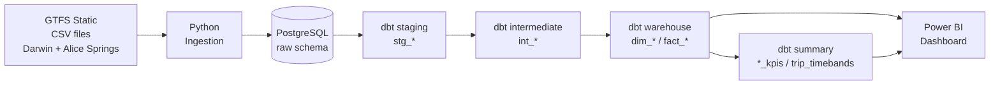
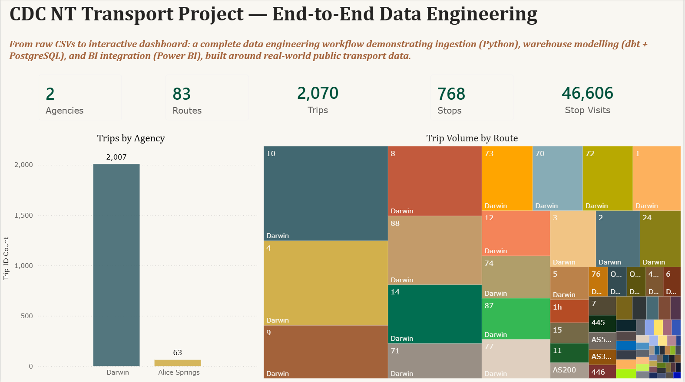
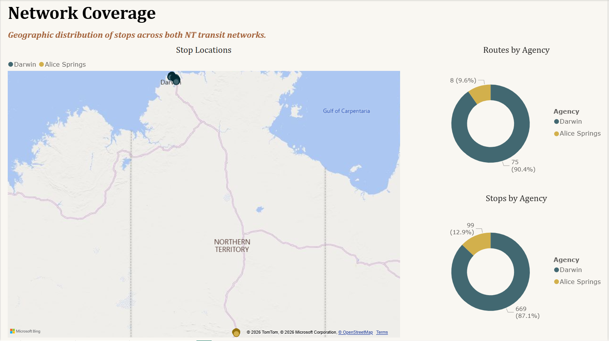
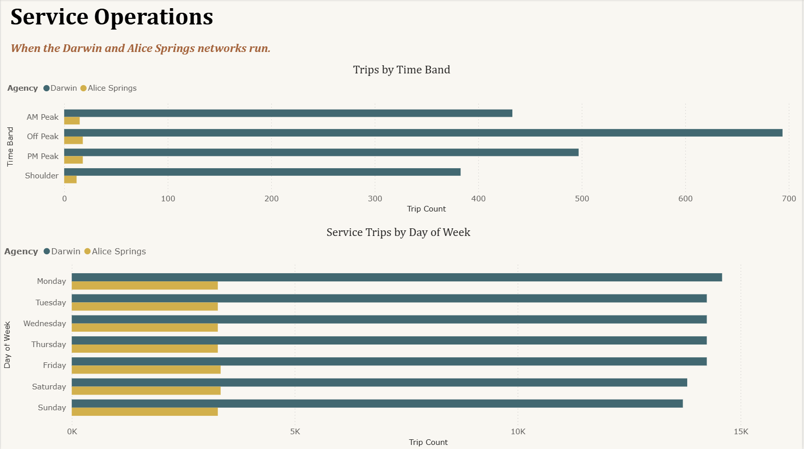
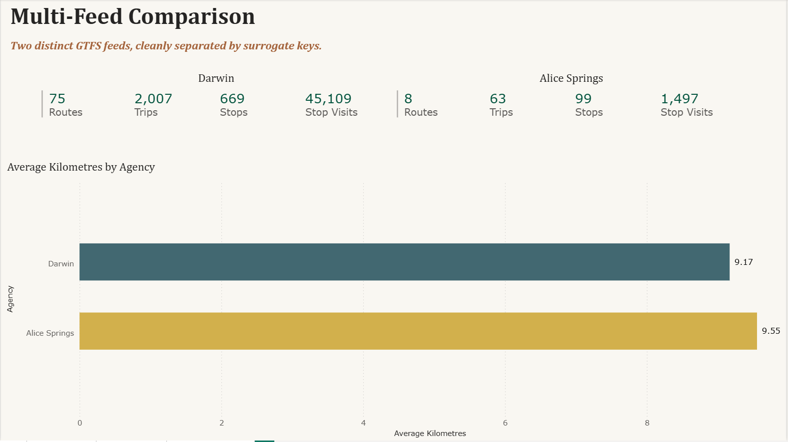

# CDC NT Transport Project

> End-to-end data engineering portfolio project — from raw CSV files to interactive Power BI dashboard.

A complete data engineering workflow demonstrating ingestion, warehouse modelling, and BI integration, built around real-world public transport data from the Northern Territory of Australia.

The project ingests GTFS-Static feeds from the Northern Territory's two transit agencies (Darwin and Alice Springs), models them in a star schema using dbt and PostgreSQL, and surfaces the result in a Power BI dashboard.

---

## Architecture



---

## Tech stack

| Layer           | Tool                                                |
| --------------- | --------------------------------------------------- |
| Source          | GTFS-Static (CDC NT) — Darwin & Alice Springs feeds |
| Ingestion       | Python (CSV → PostgreSQL)                           |
| Warehouse       | PostgreSQL 15                                       |
| Transformations | dbt (staging → intermediate → warehouse → summary)  |
| BI              | Power BI Desktop                                    |
| Version control | Git + GitHub                                        |

---

## Dashboard

The dashboard has 4 pages, each focusing on a different angle of the transit data.

### Page 1 — Overview

Headline KPIs and project framing.



### Page 2 — Network Coverage

Geographic distribution of stops across both NT transit networks. The map proves the multi-feed pipeline works — two distinct clusters of stops appear roughly 1,500 km apart (Darwin in the north, Alice Springs in the central NT).



### Page 3 — Service Operations

When the networks run — by time of day and day of week. Both networks show flat day-of-week patterns, suggesting consistent service rather than typical commuter peaks.



### Page 4 — Multi-Feed Comparison

Darwin vs Alice Springs side-by-side. Darwin operates roughly 10× the volume of Alice Springs across every metric, but average trip distances are nearly identical (9.17 km vs 9.55 km) — both networks follow urban-style design despite the size difference.



---

## Key design decisions

### Multi-feed surrogate keys

Both source feeds (Darwin and Alice Springs) reuse the same numeric IDs for different real-world entities — Darwin's stop `101` and Alice Springs' stop `101` are completely different stops in different cities, but the source data labels them identically. Combining the two feeds without distinguishing the source caused 75 duplicate `stop_id` values in the warehouse.

The fix: composite surrogate keys built as `feed_id || '_' || natural_id`, producing readable values like `darwin_101` and `alice_springs_101`. Applied to `dim_stops`, `dim_agency`, `fact_stop_times`, and `dim_routes`.

This is the kind of issue that real-world DE work runs into when integrating multiple data sources — handled at the warehouse layer rather than working around it in BI.

### GTFS extended-hour times

GTFS allows departure times like `24:26:00` or `25:30:00` to mean _"next-day clock time, but still part of today's service day."_ This is intentional in the spec — keeps a late-night trip that crosses midnight inside the same service-day grouping. PostgreSQL's `TIME` type rejects these values, so any `::TIME` cast errors out.

Resolved with `::INTERVAL` casts (which natively handle hours ≥ 24) and explicit normalisation in the time-band classification model.

### Star schema with deliberate snowflakes

Core star schema (fact + dim tables), with two intentional dim-to-dim "snowflake" relationships: `dim_routes → dim_agency` and `dim_stops → dim_agency`. These let visualisations slice fact data by agency without requiring extra lookups in DAX.

### Display logic in dbt, not BI

Clean human-readable names (`Darwin`, `Alice Springs`) were derived in dbt warehouse models rather than Power BI calculated columns. This keeps presentation logic version-controlled and visible to any future consumer of the warehouse, not just this specific Power BI file.

For deeper architectural reflection — see `LEARNINGS.md`.

---

## Project structure

```
cdc_nt_gtfs/
├── ingestion/                 # Python GTFS ingestion script
│   └── ingest_gtfs.py
├── gtfs_data/                 # Source CSV files
│   ├── extracted_darwin/
│   └── extracted_alice_springs/
├── models/                    # dbt models
│   ├── staging/               # stg_* (column cleanup, type casting)
│   ├── intermediate/          # int_* (business logic joins)
│   └── warehouse/             # dim_* / fact_* / *_kpis (BI-ready)
├── macros/                    # Custom dbt macros
├── tests/                     # dbt tests
├── seeds/                     # Static reference data
├── snapshots/                 # SCD snapshots (none active in v1)
├── analyses/                  # Ad-hoc analytical SQL
├── screenshots/               # Dashboard exports
├── CDC_NT Transport Project.pbix  # Power BI dashboard
├── dbt_project.yml            # dbt configuration
├── README.md                  # this file
├── LEARNINGS.md               # Lessons learned, mistakes & diagnoses, design decisions
├── NEXT_PROJECT.md            # Roadmap for project #2
└── PROJECT_CONTEXT.md         # Working state and session context
```

---

## Running the project

### Prerequisites

- Python 3.11+
- PostgreSQL 15+ (local or hosted)
- dbt-core with the postgres adapter
- Power BI Desktop (for the .pbix file)

### Setup

1. Clone the repo:

   ```bash
   git clone https://github.com/Pheluciam/cdc-nt-gtfs-project.git
   cd cdc-nt-gtfs-project
   ```

2. Create the Python virtual environment and install dependencies:

   ```bash
   python -m venv dbt_venv
   ./dbt_venv/Scripts/Activate.ps1   # Windows PowerShell
   # or: source dbt_venv/bin/activate  # macOS/Linux
   pip install dbt-postgres
   ```

3. Configure database connection:
   - Create a Postgres database called `CDC_NT`
   - Configure `~/.dbt/profiles.yml` with your connection details (see `profiles.yml.example` if provided)

4. Ingest the GTFS source data:

   ```bash
   python ingestion/ingest_gtfs.py
   ```

5. Run dbt to build the warehouse models:

   ```bash
   dbt run
   dbt test
   ```

6. Open `CDC_NT Transport Project.pbix` in Power BI Desktop and refresh.

---

## Documentation

This repo contains several documents that go deeper than this README:

- **`LEARNINGS.md`** — running journal of lessons learned, mistakes & diagnoses (the multi-feed key collision, GTFS extended hours, dbt vs Power BI architectural decisions, etc.).
- **`NEXT_PROJECT.md`** — planning document for project #2 (cloud-native rebuild, supply chain / demand planning domain, MS SQL Server / Databricks / Airflow exploration)
- **`PROJECT_CONTEXT.md`** — current state, working notes, and immediate next steps. Used as a session-restart anchor

---

## Status

**v1 — Complete.** All 4 dashboard pages built, dbt models tested, documentation in place, repo public on GitHub.

This is my first end-to-end data engineering project, completed as a portfolio piece. Trade-offs accepted in v1 (manual pipeline, no orchestration, no CI/CD) are documented and addressed in `NEXT_PROJECT.md` as deliberate scope decisions for the next project.

---

## Notes for reviewers

- **Engineering focus**: this project is intended to demonstrate data engineering practice — the warehouse design, multi-source integration, dbt modelling, and SQL quality matter more than the dashboard polish
- **Real-world data quirks handled** (GTFS extended hours, multi-feed ID collisions) are documented in `LEARNINGS.md`
- **What v1 deliberately doesn't include** (orchestration, CI/CD, cloud warehouse) is captured in `NEXT_PROJECT.md` as project #2 features
- The pipeline is currently manual. Orchestration via Airflow is the headline feature planned for project #2
