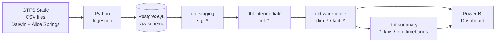
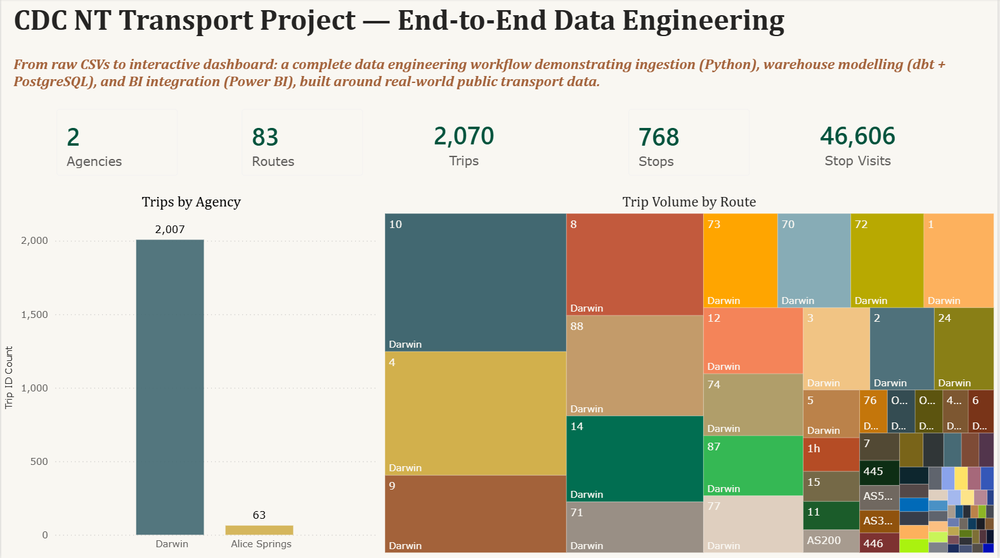
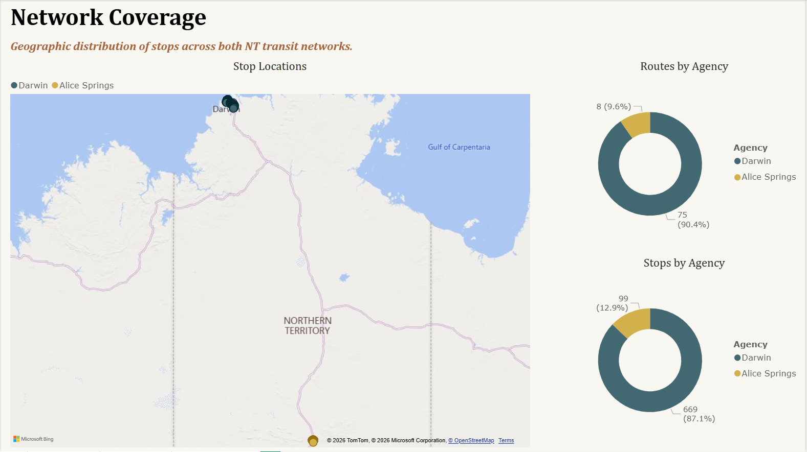
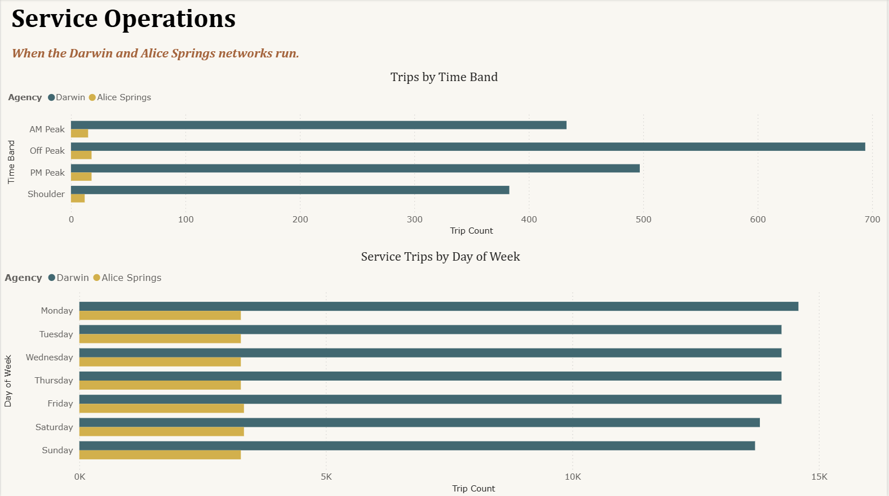
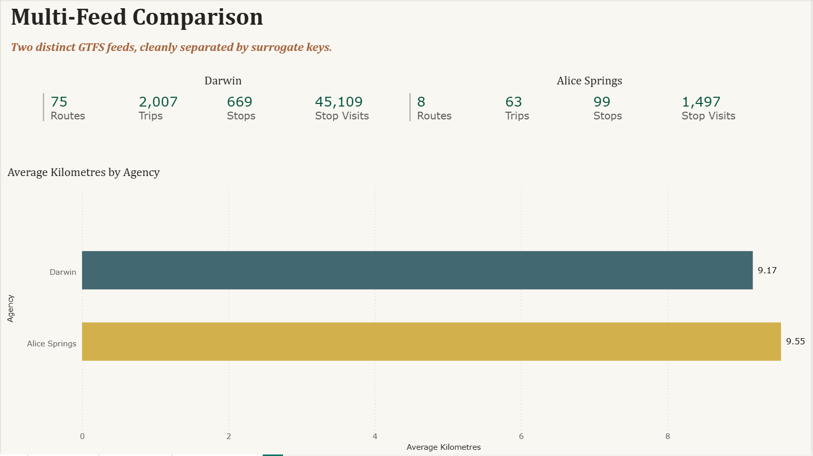

# CDC NT Transport Project

> dbt-first analytics pipeline — GTFS-Static public-transport feeds (Darwin +
> Alice Springs) → Python ingestion → PostgreSQL → dbt star schema
> (staging → intermediate → warehouse → summary) → 4-page Power BI dashboard.
> Project #1 of my data-engineering portfolio.

**Status: COMPLETE — shipped 2026-05-09.** End-to-end and interview-ready: Python ingestion → PostgreSQL → dbt (36 models, 28 passing tests) → 4-page Power BI dashboard, built on real Northern Territory GTFS feeds. Full build history, design decisions and the lessons log live in `PROJECT_CONTEXT.md` and `LEARNINGS.md`.

## What this project demonstrates

- **End-to-end pipeline** from a raw public-data source (GTFS-Static feeds) to a BI dashboard
- **Multi-source integration** — two NT transit feeds (Darwin + Alice Springs) combined with composite surrogate keys (`feed_id || '_' || natural_id`) that resolve cross-feed ID collisions
- **Kimball star schema** (fact + dim tables) with two deliberate dim-to-dim snowflake links (`dim_routes → dim_agency`, `dim_stops → dim_agency`)
- **Layered dbt modelling** — 36 models across staging → intermediate → warehouse → summary
- **dbt data tests** — 28 passing (`unique` + `not_null` on every dim primary key, plus relationship tests)
- **Real-world data-quirk handling** — GTFS extended-hour times (`24:00+`) resolved with `::INTERVAL` casts; agency-specific distance units verified at ingestion
- **Display logic in dbt, not the BI tool** — human-readable names derived in the warehouse so any consumer sees clean labels
- **4-page Power BI** dashboard (Import mode `.pbix` — opens standalone for reviewers)

## Architecture


```mermaid
flowchart LR
    A[GTFS Static<br/>CSV files<br/>Darwin + Alice Springs] --> B[Python<br/>Ingestion]
    B --> C[(PostgreSQL<br/>raw schema)]
    C --> D[dbt staging<br/>stg_*]
    D --> E[dbt intermediate<br/>int_*]
    E --> F[dbt warehouse<br/>dim_* / fact_*]
    F --> G[dbt summary<br/>*_kpis / trip_timebands]
    F --> H[Power BI<br/>Dashboard]
    G --> H
```

## Stack

| Layer | Choice |
|---|---|
| Source | GTFS-Static (CDC NT) — Darwin & Alice Springs feeds |
| Ingestion | Python (CSV → PostgreSQL) |
| Warehouse | PostgreSQL 15 |
| Transformation | dbt (staging → intermediate → warehouse → summary) |
| Modeling | Kimball star schema with deliberate snowflakes |
| BI | Power BI Desktop (Import mode `.pbix`) |
| Version control | Git + GitHub |

## Project structure

```
cdc_nt_gtfs/
├── ingestion/                     # Python GTFS ingestion script
│   └── ingest_gtfs.py
├── gtfs_data/                     # Source CSV feeds
│   ├── extracted_darwin/
│   └── extracted_alice_springs/
├── models/                        # dbt models (36 total)
│   ├── staging/                   # stg_* (column cleanup, type casting)
│   ├── intermediate/              # int_* (business-logic joins)
│   └── warehouse/                 # dim_* / fact_* / *_kpis (BI-ready)
├── macros/                        # Custom dbt macros
├── tests/                         # dbt tests
├── seeds/                         # Static reference data
├── snapshots/                     # SCD snapshots (none active in v1)
├── analyses/                      # Ad-hoc analytical SQL
├── screenshots/                   # Dashboard exports
├── CDC_NT Transport Project.pbix  # Power BI dashboard
├── dbt_project.yml                # dbt configuration
├── README.md                      # this file
├── LEARNINGS.md                   # lessons learned, diagnoses, design decisions
├── PROJECT_CONTEXT.md             # working state and session context
├── NEXT_PROJECT.md                # end-of-project-1 portfolio roadmap journal
└── TEACHING_PREFERENCES.md        # how I like to work / learning preferences
```

## How this project was built

This project was built using AI-assisted pair programming (Claude by Anthropic).
All architecture decisions, technology selections, and final design choices are
my own; the AI accelerated implementation and acted as a senior-DE code reviewer.
The intent of the project is portfolio learning — every component was built with
explicit understanding of what it does and why. Design decisions and the
diagnosis → fix → lesson loops are documented in `LEARNINGS.md`.

## Project documents

- `LEARNINGS.md` — lessons-learned journal: diagnosis → fix → lesson loops (the multi-feed key collision, GTFS extended hours, the dbt-vs-Power BI architecture line)
- `PROJECT_CONTEXT.md` — running session state + the v1 ship summary
- `NEXT_PROJECT.md` — roadmap journal written at the end of Project #1, sketching the portfolio progression that became Projects #2 and #3
- `TEACHING_PREFERENCES.md` — how I like to work and where I want more or less detail

## Dashboard

Four pages built in Power BI Desktop on the dbt warehouse. Import storage mode —
the `.pbix` opens standalone for reviewers. Live report:
`CDC_NT Transport Project.pbix`.

### Overview



Headline KPIs across both networks — 2 agencies, 83 routes, 2,070 trips, 768
stops and 46,606 stop visits — with Trips by Agency and a Trip-Volume-by-Route
treemap.

### Network Coverage



Geographic distribution of stops across both NT networks. The map proves the
multi-feed pipeline works — two clusters roughly 1,500 km apart (Darwin in the
north, Alice Springs in the central NT) — alongside routes- and stops-per-agency
donuts.

### Service Operations



When the networks run — by time band and day of week. Both networks show flat
day-of-week patterns, suggesting consistent service rather than typical commuter
peaks.

### Multi-Feed Comparison



Darwin vs Alice Springs side-by-side. Darwin is roughly an order of magnitude
larger across routes, stops and stop-visits, yet average trip distances are
nearly identical (9.17 km vs 9.55 km) — both networks follow urban-style design
despite the size difference.

## Related projects

Part of my data-engineering portfolio — focused builds first, then full end-to-end platforms:

- **Focused Build 1 — [operations-analytics-dbt-tableau-project](https://github.com/Pheluciam/operations-analytics-dbt-tableau-project)** — dbt testing + macros depth on a warehouse-distribution slice; PostgreSQL → dbt → Tableau.
- **Focused Build 2 — [analytics-tsql-adf-project](https://github.com/Pheluciam/analytics-tsql-adf-project)** — Jira REST → Azure Data Factory → Azure SQL → T-SQL star schema → Power BI.
- **Focused Build 3 — [health-analytics-fabric-project](https://github.com/Pheluciam/health-analytics-fabric-project)** — Microsoft Fabric end-to-end: AIHW MyHospitals API → Lakehouse medallion → PySpark star schema → Power BI.
- **End-to-End Platform 1 — cdc-nt-gtfs-project** *(this one)* — dbt-first pipeline on PostgreSQL → Power BI; Kimball modelling foundation.
- **End-to-End Platform 2 — [retail-demand-forecasting-project](https://github.com/Pheluciam/retail-demand-forecasting-project)** — Azure SQL → Snowflake → Airflow (Docker) → dbt → Power BI, with a Cortex forecast layer.
- **End-to-End Platform 3 — [financial-analytics-lakehouse-project](https://github.com/Pheluciam/financial-analytics-lakehouse-project)** — AWS-native lakehouse: S3 + Glue + Athena + Iceberg, dbt-athena, Step Functions, 6-page Power BI, keyless OIDC CI/CD.

## Author

Phil McKechnie — Business Intelligence Analyst & Developer, Melbourne. 15+ years across operations, supply chain and analytics; the last 5 in dedicated BI roles (SQL, Tableau, Power BI). Building a data-engineering portfolio across dbt, cloud warehouses and AWS-native lakehouse work.
